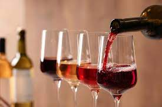
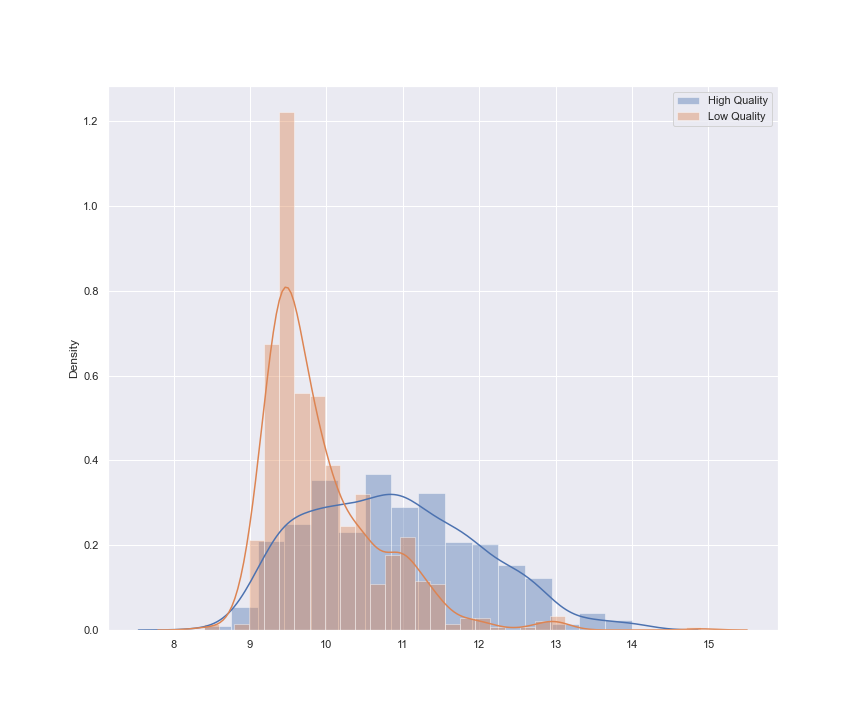

# Statistical Analysis of Wine Alcohol Content 

#### Author: [Steve Mukara Githinji](https://www.linkedin.com/in/steve-githinji-10ba0114a), [Diana Nduta Mwaura](https://www.linkedin.com/in/diana-nduta-4779bb1b1)

## Overview

The dataset is [Wine Quality Dataset](https://archive.ics.uci.edu/ml/datasets/Wine+Quality), consisting of information about red vinho verde wine samples, from the north of Portugal. The goal is to test the claim that wines with a higher quality rating have a higher median alcohol content than wines with a lower quality rating.

## Data

The dataset is [Wine Quality Dataset](https://archive.ics.uci.edu/ml/datasets/Wine+Quality) in csv format. It contained 13 columns and 1599 rows of data.

## Methods

This project used frequentist method of statistical analysis. 
Technologies used include:
* Python
* Jupyter Notebook
* Pandas, Matplotlib, Scipy, Numpy & Seaborn libraries

## Results

The distribution of the data is a near normal distribution. There are some slight differences between the median, mean and standard deviation of the high quality and low quality wines.

From our analysis, the calculated p-value was 1.0239802386368774e-74.

## Conclusions

The null hypothesis is rejected. The increase in median alcohol content in wines with a higher quality is significant at the 0.05 level.

## For More Information

For additional info, contact Steve Githinji at githinjisteve96@gmail.com or Diana Nduta at diananduta.m@gmail.com

